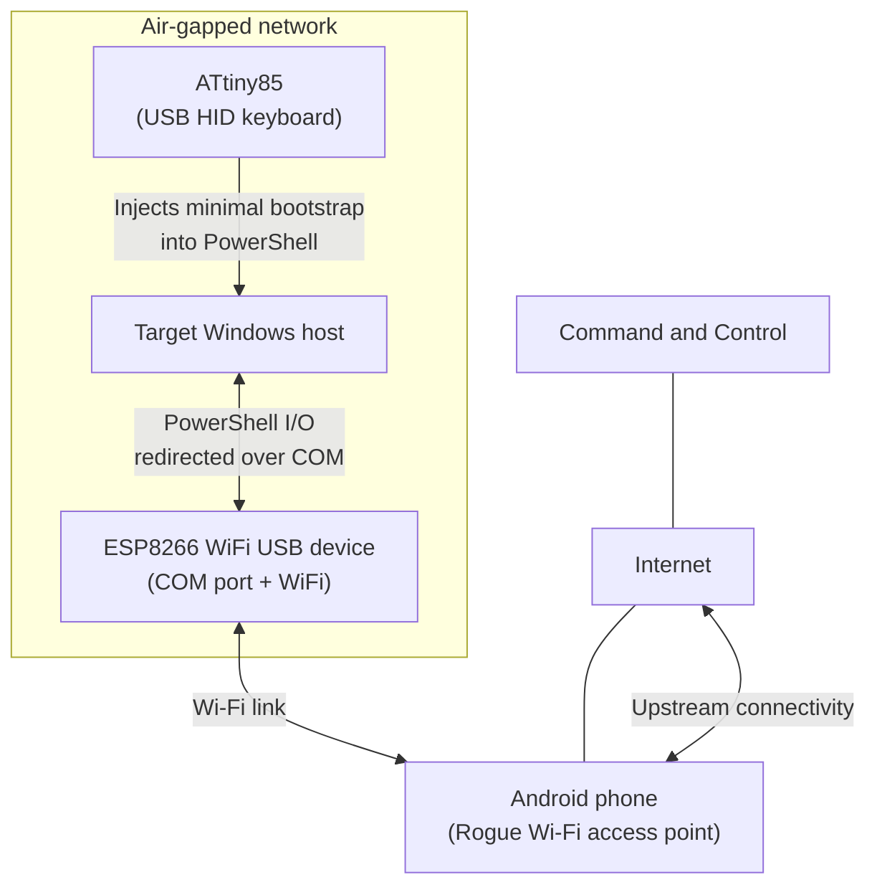

# revshellAirgap (PoC)

revshellAirgap is a proof of concept showing a lab technique to reach an interactive Reverse Shell on a network-isolated Windows host with no Internet access. For educational, authorized testing only. Do not use on systems you do not own or have explicit permission to test.

## Overview

This PoC uses three small components to relay an interactive session from an air-gapped Windows host:

- ATtiny85 (USB HID): types a short PowerShell bootstrap on the target
- ESP8266 (USB COM device): exposes a virtual COM port and forwards data between COM and a Wi-Fi connection
- Android phone: provides the Wi-Fi Rogue access point used by the ESP8266 to reach the Internet

The target does not use its own network adapters for this traffic. Data goes:
PowerShell on the target -> COM port -> ESP8266 -> Wi-Fi access point -> Internet.

## Architecture

## Components

### ATtiny85

### ESP8266 Wi-Fi

