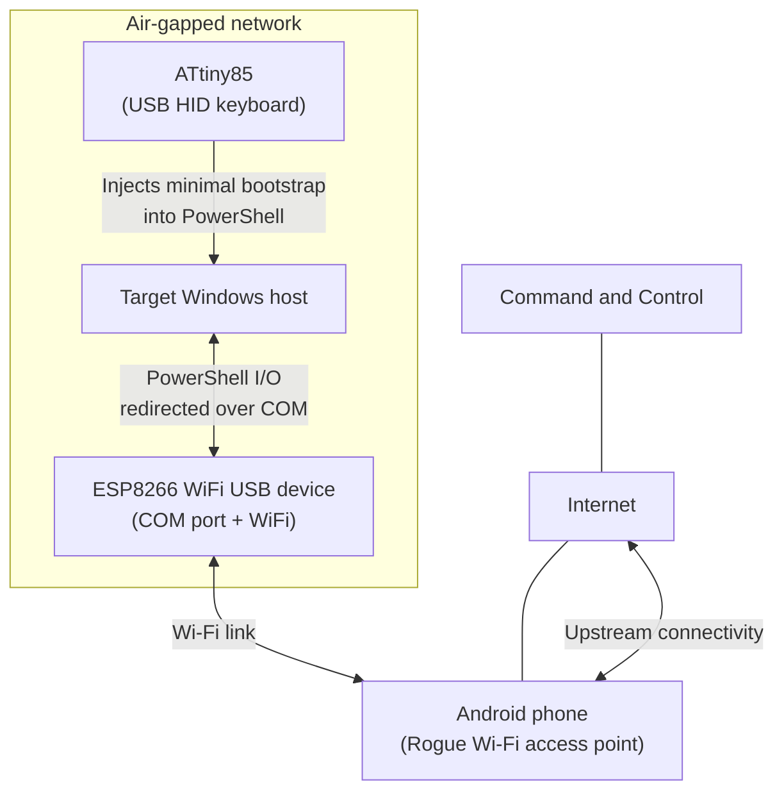

# revshellAirgap (PoC)

revshellAirgap is a proof of concept showing a lab technique to reach an interactive Reverse Shell on a network-isolated Windows host with no Internet access. For educational, authorized testing only. Do not use on systems you do not own or have explicit permission to test.

## Demo

Click below to see the video:

[](https://www.youtube.com/watch?v=v9nBg7IyuJw)

## Overview

This PoC uses three small components to relay an interactive session from an air-gapped Windows host:

- ATtiny85 (USB HID): types a short PowerShell bootstrap on the target
- ESP8266 (USB COM device): exposes a virtual COM port and forwards data between COM and a Wi-Fi connection
- Android phone: provides the Wi-Fi Rogue access point used by the ESP8266 to reach the Internet

The target does not use its own network adapters for this traffic. Data goes:

PowerShell Reverse Shell -> COM port -> ESP8266 -> Wi-Fi Rogue access point -> Internet -> Command and Control


## Architecture



## Components

### ATtiny85


### ESP8266 Wi-Fi


## How to test

**Warning: The following procedure is for setting up devices from an Arch Linux operating system. However, most of the guide is also valid for other systems.**

1. Insert the following indexes in Arduino IDE, separated by commas:
   * ATtiny Core for ATtiny85: `http://drazzy.com/package_drazzy.com_index.json`
   * Arduino Core for ESP8266: `https://arduino.esp8266.com/stable/package_esp8266com_index.json`
2. In Arduino IDE Board Manager install ATtiny Core and Arduino Core for ESP8266


3. Download the DigiKeyboard library from `https://github.com/LucaReggiannini/digikeyboard-library` and follow the instructions on GitHub page to install
4. From `https://github.com/micronucleus/micronucleus/blob/master/commandline/49-micronucleus.rules` insert the following code into `/etc/udev/rules.d/49-micronucleus.rules` to be able to upload your sketch on ATtiny85 device (Linux only):
```bash
# UDEV Rules for Micronucleus boards including the Digispark.
# This file must be placed at:
#
# /etc/udev/rules.d/49-micronucleus.rules    (preferred location)
#   or
# /lib/udev/rules.d/49-micronucleus.rules    (req'd on some broken systems)
#
# To install, type these commands in a terminal:
#   sudo cp 49-micronucleus.rules /etc/udev/rules.d/49-micronucleus.rules
#   sudo udevadm control --reload-rules
#
# After this file is copied, physically unplug and reconnect the board.
#
SUBSYSTEMS=="usb", ATTRS{idVendor}=="16d0", ATTRS{idProduct}=="0753", MODE:="0666"
KERNEL=="ttyACM*", ATTRS{idVendor}=="16d0", ATTRS{idProduct}=="0753", MODE:="0666", ENV{ID_MM_DEVICE_IGNORE}="1"
#
# If you share your linux system with other users, or just don't like the
# idea of write permission for everybody, you can replace MODE:="0666" with
# OWNER:="yourusername" to create the device owned by you, or with
# GROUP:="somegroupname" and mange access using standard unix groups.
```
5. Additionally, to be able to upload your sketch on ESP8266, you need to have the right permissions for the `/dev/ttyUSBX` file used by the device (Linux only):
```bash
me@macbook:~$ ls -l /dev/ttyUSB0
crw-rw---- 1 root uucp 188, 0 Dec 20 05:16 /dev/ttyUSB0
me@macbook:~$ sudo usermod -aG uucp $USER
```
6. **Read carefully the "ATtiny85Keyboard.ino" and "Esp8266AP.ino" source code to change the variables based on your testing environment (IP, PORT, PnP Device ID...)**
7. Upload the "ATtiny85Keyboard.ino" sketch to the ATtiny85 (Micronucleus bootloader). When you plug it in, it runs the Micronucleus bootloader for a few seconds and then starts the sketch (which enumerates as a USB HID keyboard), so the Arduino IDE may prompt you to unplug and replug the device during flashing
8. Upload the "Esp8266AP.ino" sketch to the ESP8266. The Arduino IDE will ask you to select the `/dev/ttyUSBX` port the device is connected to
9. Configure a listener (for example using Netcat) on your server, based on the IP/PORT combination you entered in the "Esp8266AP.ino" file (you may need to configure a Port Forwarding Rule on your router)
10. Setup your Wi-Fi Rogue Access Point
11. Attach the ESP8266 device (wait for USB drivers to be installed) on the target Windows host
11. Attach the ATtiny85 device and wait for the payload to be executed
13. You should see an incoming connection on your listener 
